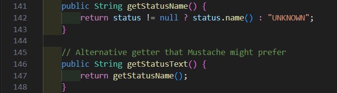
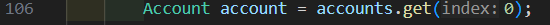

# Grupo 7
Adrián Varea Fernández, Adrián Villalba Cuello de Oro, Arturo Vinuesa Domínguez, Blas Vita Ramos, Gonzalo Andrés Zurdo Patiño, Raúl Tejada Merinero

# Análisis de Calidad del Código

## Índice
1. [Introducción y objetivo](#1-introducción-y-objetivo)
2. [Captura de Pantalla del Overview de SonarQube](#2-captura-de-pantalla-del-overview-de-sonarqube)
3. [Resultados del análisis automático y manual](#3-resultados-del-análisis-automático-y-manual)
4. [Conclusiones](#4-conclusiones)
5. [Anexos y capturas](#5-anexos-y-capturas)

---

## 1. Introducción y objetivo

En el presente documento se detalla el análisis de calidad de software realizado sobre el repositorio del proyecto `banking-app-2026`. Nuestro objetivo principal ha sido identificar, clasificar y documentar los "bad smells" (malos olores) presentes en el código base, prestando especial atención a la clase `AccountService.java`. 

Para garantizar una revisión exhaustiva, el equipo ha aplicado un enfoque híbrido. Por un lado, hemos ejecutado un escaneo automatizado mediante la plataforma SonarCloud, lo que nos ha proporcionado una visión global de las métricas de mantenibilidad, fiabilidad y seguridad del sistema. Por otro lado, hemos llevado a cabo una inspección manual minuciosa, indispensable para detectar problemas de diseño o violaciones de principios arquitectónicos (como SOLID, DRY o la Ley de Demeter) que las herramientas automáticas suelen pasar por alto. 

Siguiendo estrictamente las directrices de la práctica, este informe se centra de manera exclusiva en la fase de detección, análisis y diagnóstico de los problemas, dejando la refactorización y la implementación de pruebas para etapas posteriores del proyecto.

---

## 2. Captura de Pantalla del Overview de SonarQube

En las capturas superiores se muestra el estado general del proyecto tras el primer escaneo. Se pueden observar las métricas de mantenibilidad (Code Smells), fiabilidad y seguridad antes de aplicar cualquier corrección.

---

## 3. Resultados del análisis automático y manual

### Issue 1: Duplicación del literal "Deposit Confirmation"
**Reporte de la issue**:

**Explicación del mal olor detectado**:
- Ubicación: `src/main/java/es/codeurjc/service/AccountService.java`, líneas 107, 114, 156, 163.
- Tipo: Code Smell (Critical).
- Descripción: El literal "Deposit Confirmation" se repite cuatro veces en el código para definir el asunto de las notificaciones, tanto para el canal de Email como para el de SMS.
- Justificación: Es un problema real de mantenibilidad. Al tener el mismo texto "hardcodeado" en varios puntos, cualquier cambio futuro en el mensaje obligaría a modificar el código en muchos lugares, aumentando el riesgo de olvidar alguno y generar algún tipo de inconsistencia. Lo adecuado sería extraer este valor a una constante única para poder centralizar el mensaje y facilitar su gestión.

#### Refactorización *(NO REALIZAR HASTA TAREA 3)*
- Espacio para captura del código corregido o fragmento resaltado.
- Breve explicación de la solución.

---

### Issue 2: Variable "seccondAccount" sin uso en AccountService
**Reporte de la issue**:

**Explicación del mal olor detectado**:
- Ubicación: `src/main/java/es/codeurjc/service/AccountService.java`, línea 185.
- Tipo: Code Smell (Minor).
- Descripción: Se ha dejado declarada una variable llamada seccondAccount que no hace nada en el método de retiro.
- Justificación: Es un problema real aunque de baja prioridad. Es simplemente código muerto que sobra. Al leer el código, da la sensación de que falta algo por programar o que se ha quedado ahí después de un borrador previo, por lo que debería eliminarse para no confundir.

#### Refactorización *(NO REALIZAR HASTA TAREA 3)*
- Espacio para captura del código corregido o fragmento resaltado.
- Breve explicación de la solución.

---

### Issue 3: Las cadenas de texto no se comparan usando "equals()"
**Reporte de la issue**:

**Explicación del mal olor detectado**:
- Ubicación: `src/main/java/es/codeurjc/service/AccountService.java`, línea 235.
- Tipo: Bug (Major).
- Descripción: Se está utilizando el operador de igualdad referencial "==" para comparar dos números de cuenta que son de tipo String.
- Justificación: Es un problema real y grave. El operador "==" comprueba si ambos objetos son la misma instancia en memoria, no si tienen el mismo contenido, por lo que en este caso la comparación podría devolver false aunque los números sean idénticos. Lo que habría que hacer es cambiar esta línea por "m.getAccountNumber().equals(o.getAccountNumber())".

#### Refactorización *(NO REALIZAR HASTA TAREA 3)*
- Espacio para captura del código corregido o fragmento resaltado.
- Breve explicación de la solución.

---

### Issue 4: Nombres de variables no descriptivos en AccountService
**Reporte de la issue**:

**Explicación del mal olor detectado**:
- Ubicación: `src/main/java/es/codeurjc/service/AccountService.java`, líneas 231 y 232.
- Tipo: Mantenibilidad (Nombres crípticos).
- Descripción: En el método de transferencia se usan las letras "m" y "o" para referirse a las cuentas de origen y destino.
- Justificación: Es un problema real. El uso de variables de una sola letra obliga a cualquier programador que lea el código a tener que adivinar qué cuenta es cuál. Lo correcto sería usar nombres como "sourceAccount" y "destinationAccount" para que el código se explique por sí solo sin necesidad de comentarios.

#### Refactorización *(NO REALIZAR HASTA TAREA 3)*
- Espacio para captura del código corregido o fragmento resaltado.
- Breve explicación de la solución.

---

### Issue 5: Validaciones de negocio redundantes e inalcanzables
**Reporte de la issue**:

**Explicación del mal olor detectado**:
- Ubicación: `src/main/java/es/codeurjc/service/AccountService.java`, líneas 87 a 89.
- Tipo: Lógica redundante (Dead Code).
- Descripción: Se comprueba si el importe es mayor de 10.000 y, justo después, si es mayor de 50.000 para lanzar el mismo error.
- Justificación: Es un problema de lógica real. Si alguien intenta ingresar 60.000, el programa saltará en el primer "if" (el de 10.000) y nunca llegará a evaluar el segundo. Esto hace que el código sea confuso y parezca que los límites de seguridad no están bien definidos o que se ha copiado y pegado el código sin revisarlo.

#### Refactorización *(NO REALIZAR HASTA TAREA 3)*
- Espacio para captura del código corregido o fragmento resaltado.
- Breve explicación de la solución.

---

### Issue 6: Duplicación de lógica en los métodos de depósito
**Reporte de la issue**:

**Explicación del mal olor detectado**:
- Ubicación: `src/main/java/es/codeurjc/service/AccountService.java`, métodos deposit (líneas 76 a 169).
- Tipo: Violación del principio DRY (Don't Repeat Yourself).
- Descripción: Existen dos métodos para depositar dinero que repiten exactamente las mismas validaciones y la misma lógica de guardado y notificación.
- Justificación: Es un problema real de duplicación. Si en el futuro el banco decide cambiar una regla de depósito, el desarrollador tendrá que modificar dos métodos distintos. El método corto (sin descripción) debería simplemente llamar al método largo pasando una descripción por defecto, evitando así tener el código duplicado.

#### Refactorización *(NO REALIZAR HASTA TAREA 3)*
- Espacio para captura del código corregido o fragmento resaltado.
- Breve explicación de la solución.

---

### Issue 7: Nomenclatura inadecuada en métodos de borrado
**Reporte de la issue**:

**Explicación del mal olor detectado**:
- Ubicación: `src/main/java/es/codeurjc/service/AccountService.java`, línea 301.
- Tipo: Diseño de API / Mantenibilidad.
- Descripción: El método para eliminar una cuenta se llama simplemente "rm".
- Justificación: Es un mal olor claro. Aunque "rm" es un comando conocido en sistemas Linux, en el contexto de un servicio Java de una aplicación bancaria se deben usar nombres verbales completos como "deleteAccount". Las abreviaturas crípticas reducen la legibilidad de la arquitectura del sistema.

#### Refactorización *(NO REALIZAR HASTA TAREA 3)*
- Espacio para captura del código corregido o fragmento resaltado.
- Breve explicación de la solución.

---

### Issue 8: Números mágicos/hardcodeados
**Reporte de la issue**:

**Explicación del mal olor detectado**:
- Ubicación: `src/main/java/es/codeurjc/service/AccountService.java`. Líneas 67-78 y 114-125 (en `deposit`), línea 179 (en `withdraw`) y línea 226 (en `transfer`).
- Tipo: Diseño de API / Mantenibilidad (Code Smell).
- Descripción: Se utilizan números "mágicos" (hardcodeados) directamente en las condiciones lógicas para definir los límites de negocio del banco: 10.000 y 50.000 para depósitos, 5.000 para retiros y 20.000 para transferencias.
- Justificación: Es un mal olor real. Las reglas de negocio cambian con el tiempo y tenerlas sueltas como números crudos por todo el código hace que el mantenimiento sea complicado y propenso a errores. Si el banco cambia un límite, hay que buscar y modificar el número exacto línea por línea. Lo correcto sería definir estos valores como constantes (por ejemplo, `MAX_WITHDRAWAL_LIMIT = 5000`) al inicio de la clase.

#### Refactorización *(NO REALIZAR HASTA TAREA 3)*
- Espacio para captura del código corregido o fragmento resaltado.
- Breve explicación de la solución.

---

### Issue 9: Condicionales redundantes y separadas
**Reporte de la issue**:

**Explicación del mal olor detectado**:
- Ubicación: `src/main/java/es/codeurjc/service/AccountService.java`, líneas 77-89 y 126-138 (en ambos métodos `deposit`).
- Tipo: Lógica redundante / Code Smell (Inspección manual).
- Descripción: Se están utilizando dos bloques `if` separados para comprobar si el importe es igual a cero (`amount == 0`) y, a continuación, otro para comprobar si es menor que cero (`amount < 0`), lanzando exactamente la misma excepción en ambos casos.
- Justificación: Es un problema real de calidad de código. Resulta innecesariamente verboso y repite la misma lógica de error. Esto se puede simplificar fácilmente en una única condición `if (amount <= 0)`, mejorando la legibilidad.

#### Refactorización *(NO REALIZAR HASTA TAREA 3)*
- Espacio para captura del código corregido o fragmento resaltado.
- Breve explicación de la solución.

---

### Issue 10: Duplicación masiva de la lógica de notificaciones
**Reporte de la issue**:

**Explicación del mal olor detectado**:
- Ubicación: `src/main/java/es/codeurjc/service/AccountService.java`. El bloque se repite 5 veces (líneas 102-118, 151-166, 201-213, 266-278 y 281-294).
- Tipo: Violación del principio DRY (Don't Repeat Yourself) / Code Smell (Inspección manual).
- Descripción: La lógica para comprobar qué tipo de notificación tiene configurada el usuario (`EMAIL` o `SMS`) y realizar el envío a través del servicio correspondiente está copiada y pegada a lo largo de todos los métodos de operaciones bancarias.
- Justificación: Es un problema real y grave de mantenibilidad. Si en el futuro se añade un nuevo canal de notificación, habrá que modificar el código en 5 lugares distintos, aumentando el riesgo de errores. La solución ideal sería extraer esta lógica a un método privado genérico.

#### Refactorización *(NO REALIZAR HASTA TAREA 3)*
- Espacio para captura del código corregido o fragmento resaltado.
- Breve explicación de la solución.

---

### Issue 11: Método con exceso de responsabilidades (Long Method)
**Reporte de la issue**:

**Explicación del mal olor detectado**:
- Ubicación: `src/main/java/es/codeurjc/service/AccountService.java`, método `transfer` (líneas 223 a 296).
- Tipo: Long Method / Violación de Single Responsibility Principle (Inspección manual).
- Descripción: El método `transfer` es demasiado largo y asume demasiadas responsabilidades: valida límites, comprueba saldos, realiza retiros e ingresos, crea transacciones, guarda en base de datos y envía notificaciones.
- Justificación: Es un problema real de diseño. Al acumular tantas operaciones, el método tiene una carga cognitiva muy alta, es difícil de testear y propenso a errores. Debería refactorizarse dividiéndolo en submétodos más pequeños y específicos.

#### Refactorización *(NO REALIZAR HASTA TAREA 3)*
- Espacio para captura del código corregido o fragmento resaltado.
- Breve explicación de la solución.

---

### Issue 12: Literales de texto duplicados en Excepciones
**Reporte de la issue**:

**Explicación del mal olor detectado**:
- Ubicación: `src/main/java/es/codeurjc/service/AccountService.java`. Mensaje `"Amount must be positive"` en líneas 79, 82, 128, 131, 177 y 225. Mensaje `"Amount exceeds maximum deposit limit"` en líneas 85, 88, 134 y 137.
- Tipo: Violación del principio DRY / Code Smell (Inspección manual).
- Descripción: Los mensajes de error de las validaciones están escritos como cadenas de texto ("Strings") literales repetidas múltiples veces a lo largo de los métodos `deposit`, `withdraw` y `transfer`.
- Justificación: Es un problema real de mantenibilidad. Tener mensajes "hardcodeados" y duplicados dificulta la consistencia del sistema. Si se desea internacionalizar la aplicación o simplemente corregir una errata en el mensaje, el desarrollador debe buscar y modificar cada instancia individualmente, aumentando el riesgo de inconsistencias. Lo adecuado es centralizar estos textos en constantes de clase.

#### Refactorización *(NO REALIZAR HASTA TAREA 3)*
- Espacio para captura del código corregido o fragmento resaltado.
- Breve explicación de la solución.

---

### Issue 13: Uso excesivo de Excepciones Genéricas
**Reporte de la issue**:

**Explicación del mal olor detectado**:
- Ubicación: `src/main/java/es/codeurjc/service/AccountService.java`. Líneas 63, 79, 82, 85, 88, 128, 131, 134, 137, 177, 181, 225, 228, 236, 241 y 305.
- Tipo: Anti-patrón de manejo de errores / Code Smell (Inspección manual).
- Descripción: Se utiliza sistemáticamente la excepción genérica `IllegalArgumentException` para reportar errores de naturaleza muy distinta: fallos de validación, cuenta no encontrada, fondos insuficientes o errores de borrado.
- Justificación: Es un problema real que afecta la testabilidad y la extensibilidad. Al lanzar siempre la misma excepción genérica, es imposible para las capas superiores (como un controlador de API) capturar fallos específicos para dar respuestas personalizadas al usuario (ej. diferenciar un error de "Límite excedido" de uno de "Cuenta no encontrada"). Se deberían emplear excepciones de negocio personalizadas.

#### Refactorización *(NO REALIZAR HASTA TAREA 3)*
- Espacio para captura del código corregido o fragmento resaltado.
- Breve explicación de la solución.

---

### Issue 14: Violación de la Ley de Demeter (Cadenas de mensajes)
**Reporte de la issue**:

**Explicación del mal olor detectado**:
- Ubicación: `src/main/java/es/codeurjc/service/AccountService.java`. Líneas 102, 151, 201, 266 y 281.
- Tipo: Fuerte acoplamiento / Code Smell (Inspección manual).
- Descripción: Se observa el uso repetido de la cadena de llamadas `account.getUser().getNotificationType()` para determinar el canal de notificación.
- Justificación: Es un problema real de acoplamiento. Esta estructura, conocida como "choque de trenes", obliga a `AccountService` a conocer detalles íntimos de la relación entre `Account` y `User`. Si la forma en que un usuario gestiona sus notificaciones cambia, este servicio se verá afectado innecesariamente. Siguiendo la Ley de Demeter, el servicio solo debería hablar con sus "amigos inmediatos" (la cuenta), delegando en ella la obtención del tipo de notificación mediante un método como `account.getPreferredNotificationType()`.

#### Refactorización *(NO REALIZAR HASTA TAREA 3)*
- Espacio para captura del código corregido o fragmento resaltado.
- Breve explicación de la solución.

---

### Issue 15: Validación de saldo duplicada entre capas
**Reporte de la issue**:

**Explicación del mal olor detectado**:
- Ubicación: `src/main/java/es/codeurjc/service/AccountService.java`, método `withdraw` (líneas 188-190) y `src/main/java/es/codeurjc/model/Account.java`, método `withdraw` (líneas 128-130).
- Tipo: Código duplicado / Diseño de capas.
- Descripción: La comprobación de fondos insuficientes (`if (balance < amount)`) existe tanto en el servicio como dentro del propio modelo. Además, la clase `Account` expone el método `hasSufficientBalance(amount)` que no se usa en ningún punto del código.
- Justificación: Es un problema real de diseño. La duplicación de validaciones entre capas genera inconsistencias: si las reglas cambian (por ejemplo, se permite un pequeño descubierto), hay que recordar modificar dos sitios a la vez. La responsabilidad de la validación de estado interno de la cuenta debería residir únicamente en el modelo, y el servicio debería confiar en ella.
 
#### Refactorización *(NO REALIZAR HASTA TAREA 3)*
- Espacio para captura del código corregido o fragmento resaltado.
- Breve explicación de la solución.
 
---

### Issue 16: Agrupación de datos repetidos en notificaciones (Data Clumps)
**Reporte de la issue**:

**Explicación del mal olor detectado**:
- Ubicación: `src/main/java/es/codeurjc/service/AccountService.java`, líneas 102-118, 151-166, 201-213, 266-278, 281-294.
- Tipo: Data Clumps.
- Descripción: Los métodos de notificación siempre reciben los mismos parámetros: usuario, tipo, título y mensaje.
- Justificación: Es un problema porque estos datos siempre viajan juntos, lo que indica que debería existir un objeto que los encapsule. Esto mejora la claridad y reduce errores.

#### Refactorización *(NO REALIZAR HASTA TAREA 3)*
- Espacio para captura del código corregido o fragmento resaltado.
- Breve explicación de la solución.

---

### Issue 17: Instanciación directa de dependencia (Violación de DIP)
**Reporte de la issue**:

**Explicación del mal olor detectado**:
- Ubicación: `src/main/java/es/codeurjc/service/Loan/LoanService.java`, línea 42.
- Tipo: Fuerte Acoplamiento / Violación del Principio de Inversión de Dependencias (SOLID - DIP).
- Descripción: En el constructor del servicio se instancia manualmente una dependencia mediante la instrucción `this.loanApprovalAlgorithm = new LoanApprovalAlgorithm();`.
- Justificación: Es un problema de diseño real. El Principio de Inversión de Dependencias de SOLID (DIP) indica que las clases de alto nivel no deben depender de implementaciones concretas de bajo nivel. Al usar `new` dentro del constructor, `LoanService` queda fuertemente acoplado a esa implementación específica, haciendo imposible inyectar un algoritmo distinto (por ejemplo, para pruebas unitarias con un *Mock* o si el banco cambia su lógica de préstamos en el futuro). 

#### Refactorización *(NO REALIZAR HASTA TAREA 3)*
- Espacio para captura del código corregido o fragmento resaltado.
- Breve explicación de la solución.

---

### Issue 18: Métodos redundantes y duplicación injustificada
**Reporte de la issue**:

**Explicación del mal olor detectado**:
- Ubicación: `src/main/java/es/codeurjc/model/Loan.java`, líneas 141 a 148.
- Tipo: Code Smell / Dead Code.
- Descripción: Existen dos métodos casi idénticos: `getStatusName()` y `getStatusText()`. El segundo se limita única y exclusivamente a llamar al primero. Además, en esta misma clase, se sobrescribe el método `toString()` del *Enum* `LoanStatus` solo para devolver `this.name()`, comportamiento que Java ya hace por defecto.
- Justificación: Es un mal olor de código. Según los comentarios, `getStatusText()` se creó "por ensayo y error" para que el motor de plantillas Mustache funcionara, lo que indica un parche rápido en lugar de una solución real al problema de diseño. Este código redundante aumenta la complejidad y la cantidad de líneas de código (LOC) sin aportar ningún valor, reduciendo la mantenibilidad.

#### Refactorización *(NO REALIZAR HASTA TAREA 3)*
- Espacio para captura del código corregido o fragmento resaltado.
- Breve explicación de la solución.

---

### Issue 19: Asunción de cuenta hardcodeada (Riesgo de Shotgun Surgery)
**Reporte de la issue**:

**Explicación del mal olor detectado**:
- Ubicación: `src/main/java/es/codeurjc/service/LoanService.java`, líneas 64 y 106.
- Tipo: Bug Lógico latente / Mantenibilidad (Inspección manual).
- Descripción: Al procesar un préstamo, el código recupera la lista de cuentas del usuario y asume sistemáticamente que la cuenta relevante es la primera de la lista mediante `accounts.get(0)`.
- Justificación: Es un problema real de negocio. Si un usuario tiene múltiples cuentas (por ejemplo, una de ahorros y otra corriente), el sistema siempre vinculará el préstamo a la primera que devuelva la base de datos, lo cual es impredecible y silenciosamente incorrecto. El método debería requerir explícitamente el accountId de destino para aplicar el préstamo de forma determinista y segura.

#### Refactorización *(NO REALIZAR HASTA TAREA 3)*
- Espacio para captura del código corregido o fragmento resaltado.
- Breve explicación de la solución.

---

### Issue 20: Uso de System.out.println en código de producción
**Reporte de la issue**:

**Explicación del mal olor detectado**:
- Ubicación: `src/main/java/es/codeurjc/service/EmailNotificationService.java` (Líneas 36-38).
- Tipo: Code Smell / Mala práctica de Logging (Inspección manual).
- Descripción: Se utiliza `System.out.println("Sending EMAIL to: " + user.getEmail());` para registrar eventos del sistema.
- Justificación: Es un problema real. En aplicaciones empresariales, el uso de la salida estándar de consola no permite configurar niveles de severidad (INFO, DEBUG, ERROR), ni guardar el historial en archivos o servicios de monitoreo. Además, expone datos personales del usuario (email, teléfono) sin control, lo que podría ser un problema de seguridad. Debería utilizarse un framework de logging como SLF4J o Logback.

#### Refactorización *(NO REALIZAR HASTA TAREA 3)*
- Espacio para captura del código corregido o fragmento resaltado.
- Breve explicación de la solución.

---

### Issue 21: Falta de validación de existencia previa del número de cuenta
**Reporte de la issue**:

**Explicación del mal olor detectado**:
- Ubicación: `src/main/java/es/codeurjc/service/AccountService.java`, métodos `createAccount`, `generateAccountNumber`, `getAccount` (líneas 41-64).
- Tipo: Bug potencial / Violación de reglas de negocio.
- Descripción: El método genera un número de cuenta mediante `generateAccountNumber()` y lo guarda directamente sin comprobar si ya existe en la base de datos. Además, añade este número de cuenta a la cuenta y luego lo usa para buscar cuentas, lo que nos dice que es un identificador, por lo cual debe ser único.
- Justificación: Es un problema real porque no se garantiza la unicidad del número de cuenta, lo cual es un requisito crítico en un sistema bancario. Aunque la probabilidad de colisión sea muy baja, el impacto sería grave (dos cuentas con el mismo identificador). Se debería validar contra el repositorio o delegar en la base de datos con una restricción única. No se deben correr riesgos así simplemente porque sea difícil que suceda.

#### Refactorización *(NO REALIZAR HASTA TAREA 3)*
- Espacio para captura del código corregido o fragmento resaltado.
- Breve explicación de la solución.

---

### Issue 22: Uso de tipos primitivos para representar dinero (Primitive Obsession)
**Reporte de la issue**:

**Explicación del mal olor detectado**:
- Ubicación: `src/main/java/es/codeurjc/service/AccountService.java`, métodos `deposit`, `withdraw` y `transfer` (líneas 77, 126, 175, 223).
- Tipo: Primitive Obsession.
- Descripción: Se utiliza `double` para representar cantidades de dinero (`amount`).
- Justificación: Es un problema real porque los tipos `double` pueden generar errores de precisión en operaciones financieras. Además, no encapsulan lógica de negocio como moneda o validaciones.

#### Refactorización *(NO REALIZAR HASTA TAREA 3)*
- Espacio para captura del código corregido o fragmento resaltado.
- Breve explicación de la solución.

---

## 4. Conclusiones

La realización de esta práctica nos ha permitido comprobar de primera mano que un código que compila y funciona no es, ni mucho menos, un código limpio o mantenible a largo plazo.

Durante el proceso, hemos constatado que las herramientas de análisis estático como SonarCloud son un excelente punto de partida, ya que detectan de manera inmediata duplicidades y problemas de configuración básicos. Sin embargo, el verdadero valor del control de calidad ha residido en la auditoría manual. A través de nuestra inspección, hemos sacado a la luz carencias arquitectónicas significativas y una considerable deuda técnica acumulada, identificando métodos con exceso de responsabilidades, un fuerte acoplamiento entre clases y un abuso generalizado de excepciones genéricas y tipos primitivos.

En definitiva, este análisis evidencia la importancia de aplicar principios de buen diseño (Clean Code) desde las fases iniciales del desarrollo, ya que depender únicamente del funcionamiento empírico del programa compromete gravemente su escalabilidad y la futura introducción de nuevas funcionalidades.

---

## 5. Anexos y capturas

*(Espacio reservado para anexos, enlaces adicionales o documentación extra que el grupo considere oportuna para la defensa o comprensión de la práctica):*

[CS - Tema 2.1 – Bad Smells.docx.pdf](https://github.com/user-attachments/files/26079919/CS.-.Tema.2.1.Bad.Smells.docx.pdf)
[Herramienta SonarQube Cloud](https://www.sonarsource.com/products/sonarqube/?s_campaign=SQ-APJ-1-Japan-Brand&s_content=Languages&s_term=sonarcloud&s_category=Paid&s_source=Paid%20Search&s_origin=Google&cq_src=google_ads&cq_cmp=23600038948&cq_con=200395503824&cq_term=sonarcloud&cq_med=&cq_plac=&cq_net=g&cq_pos=&cq_plt=gp&gad_source=1&gad_campaignid=23600038948&gbraid=0AAAAAC0fKmoueJlSX5zp_yyaBo4bekNSW&gclid=Cj0KCQjwmunNBhDbARIsAOndKpk0FsvHNiaBPCESgxmWNTwthCKwfppVPAmYKkqmSOCt1ZCuoKNGCb0aAgbUEALw_wcB)
