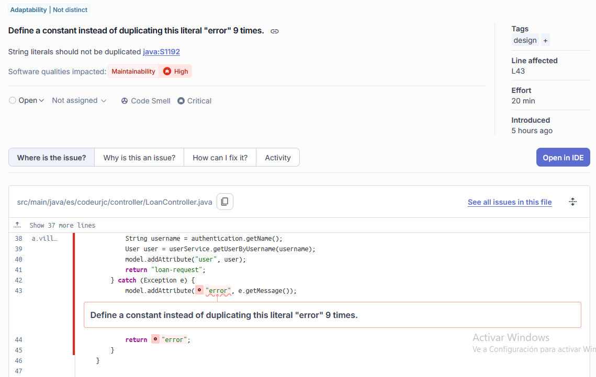
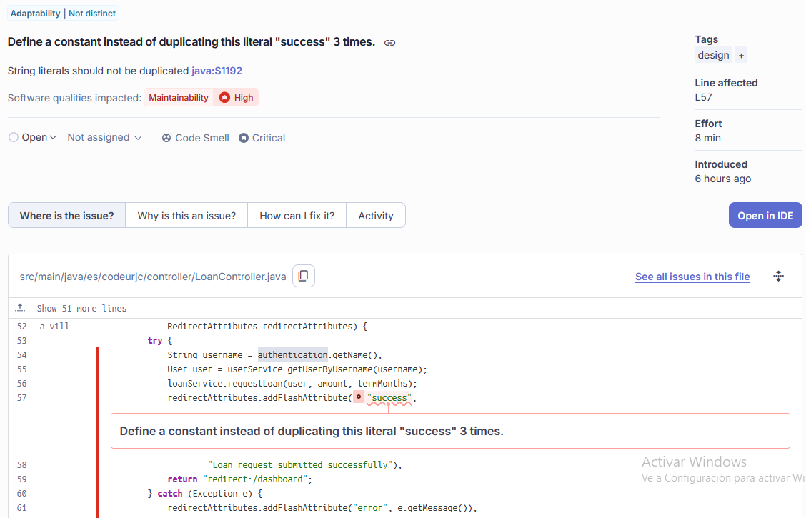
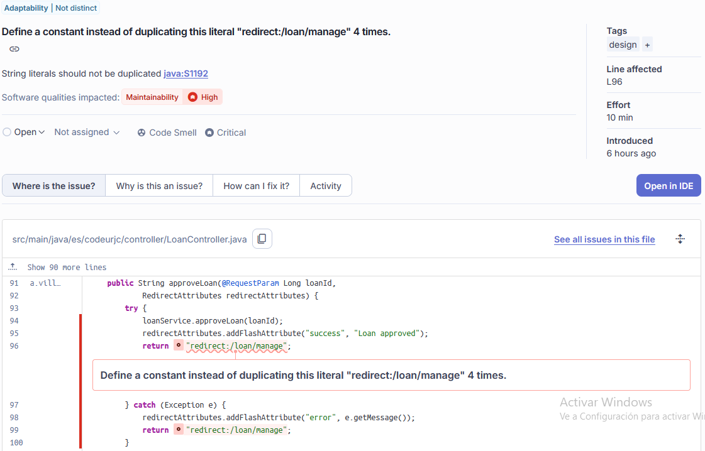
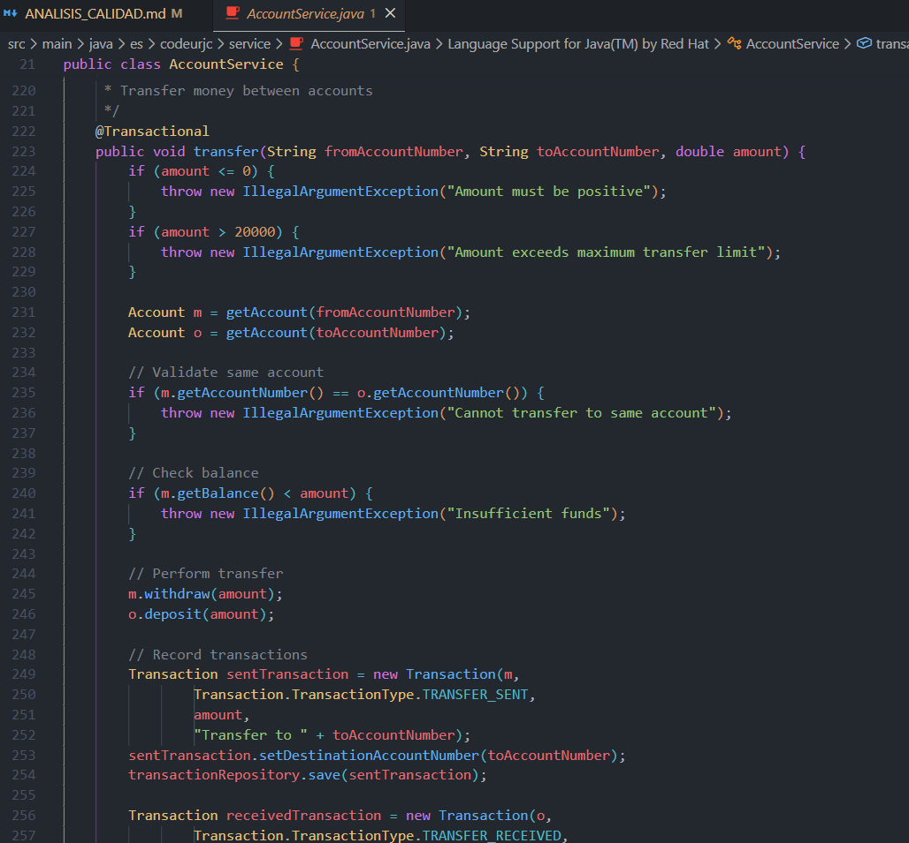
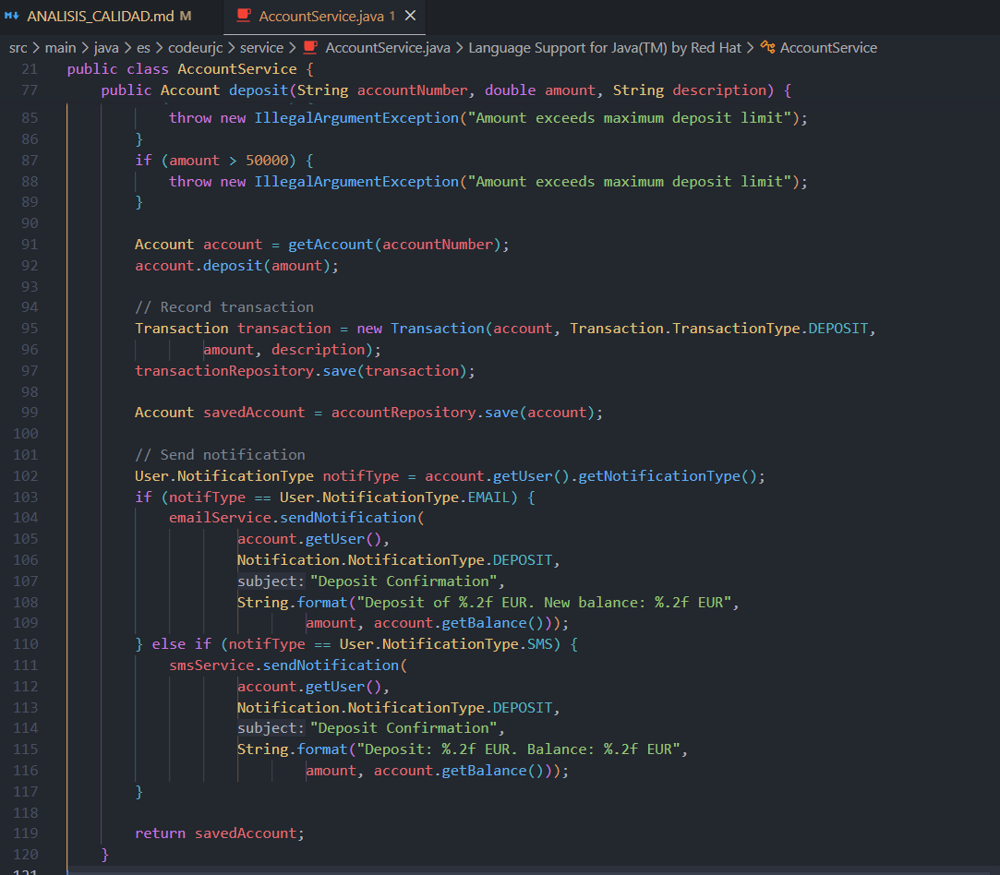

# Grupo 7
Integrantes: Adrián Varea Fernández, Adrián Villalba Cuello de Oro, Arturo Vinuesa Domínguez, Blas Vita Ramos, Gonzalo Andrés Zurdo Patiño, Raúl Tejada Merinero

# Tarea 1: Análisis de Calidad del Código

## Captura de Pantalla del Overview de SonarQube

En las capturas superiores se muestra el estado general del proyecto tras el primer escaneo. Se pueden observar las métricas de mantenibilidad (Code Smells), fiabilidad y seguridad antes de aplicar cualquier corrección.

---

## Estructura de Ejemplo para nuevos Issues
(Copiar y pegar este bloque para añadir más detecciones)

### Issue X: Título del problema
**Reporte de la issue**:

**Explicación del mal olor detectado**:
- Ubicación: archivo y línea.
- Tipo de problema: categoría de Sonar o inspección manual.
- Descripción: qué está pasando en el código.
- Justificación: razonamiento de por qué se considera un fallo y si es un falso positivo o no.

---

## Análisis de Calidad - Issues detectados

### Issue 1: Cadenas de texto duplicadas en LoanController
**Reporte de la issue**:

**Explicación del mal olor detectado**:
- Ubicación: `src/main/java/es/codeurjc/controller/LoanController.java`, desde la línea 43.
- Tipo: Code Smell (Critical).
- Descripción: La palabra "error" aparece escrita a mano 9 veces en el controlador.
- Justificación: Consideramos que es un problema real. Usar cadenas de texto repetidas (Magic Strings) hace que el código sea difícil de mantener. Si quisiéramos cambiar el nombre de la vista de error, tendríamos que buscar por todo el archivo y cambiarlo en 9 sitios, lo cual facilita que cometamos errores tipográficos. Lo ideal sería usar una constante.

### Issue 2: Repetición del literal "success" en LoanController
**Reporte de la issue**:

**Explicación del mal olor detectado**:
- Ubicación: `src/main/java/es/codeurjc/controller/LoanController.java`, líneas 57, 91 y 110.
- Tipo: Code Smell (Critical).
- Descripción: Se usa el texto "success" tres veces para gestionar los mensajes de éxito.
- Justificación: Es un problema real de limpieza de código. Al ser una clave que se envía a la interfaz, si nos equivocamos al escribirla en uno de los métodos, el mensaje de éxito no se mostraría al usuario. Centralizar esto en una sola variable evitaría confusiones.

### Issue 3: Rutas de redirección repetidas
**Reporte de la issue**:

**Explicación del mal olor detectado**:
- Ubicación: `src/main/java/es/codeurjc/controller/LoanController.java`, líneas 96, 100, 114 y 118.
- Tipo: Code Smell (Critical).
- Descripción: La ruta "redirect:/loan/manage" está escrita literalmente 4 veces.
- Justificación: Creemos que es un fallo de diseño. Si la estructura de navegación de la aplicación cambia en el futuro, es muy probable que nos olvidemos de actualizar alguna de estas rutas escritas a mano, rompiendo los enlaces del banco. Es un claro ejemplo de acoplamiento rígido con cadenas de texto.

### Issue 4: Variable "seccondAccount" sin uso en AccountService
**Reporte de la issue**:

**Explicación del mal olor detectado**:
- Ubicación: `src/main/java/es/codeurjc/service/AccountService.java`, línea 185.
- Tipo: Code Smell (Minor).
- Descripción: Se ha dejado declarada una variable llamada seccondAccount que no hace nada en el método de retiro.
- Justificación: Es un problema real aunque de baja prioridad. Es simplemente código muerto que sobra. Al leer el código, da la sensación de que falta algo por programar o que se ha quedado ahí después de un borrador previo, por lo que debería eliminarse para no confundir.

### Issue 5: Salto de transaccionalidad en LoanService
**Reporte de la issue**:

**Explicación del mal olor detectado**:
- Ubicación: `src/main/java/es/codeurjc/service/loan/LoanService.java`, línea 104.
- Tipo: Code Smell (Critical).
- Descripción: El método approveLoan llama directamente a rejectLoan usando la referencia interna.
- Justificación: Es un problema técnico real e importante relacionado con Spring. Al llamar al método directamente, nos saltamos el proxy de seguridad y la transacción no se gestiona correctamente. Esto significa que si el rechazo falla a mitad de proceso, la base de datos podría quedarse en un estado inconsistente.

### Issue 6: Mensaje de error duplicado en el servicio de préstamos
**Reporte de la issue**:

**Explicación del mal olor detectado**:
- Ubicación: `src/main/java/es/codeurjc/service/loan/LoanService.java`, líneas 90, 151, 187 y 274.
- Tipo: Code Smell (Critical).
- Descripción: El texto "Loan not found" se repite 4 veces para lanzar excepciones.
- Justificación: Es un problema real de mantenibilidad. Si el sistema necesita ser traducido o el mensaje debe ser más específico, hay que tocar demasiados puntos del código. Una constante compartida sería la solución correcta.

### Issue 7: Demasiados parámetros en el constructor de User
**Reporte de la issue**:

**Explicación del mal olor detectado**:
- Ubicación: `src/main/java/es/codeurjc/model/User.java`, línea 59.
- Tipo: Code Smell (Major).
- Descripción: El constructor de la clase User recibe 10 argumentos de golpe.
- Justificación: Consideramos que es un problema de diseño claro. Con tantos parámetros es muy fácil equivocarse al crear un usuario y poner, por ejemplo, el teléfono donde va el DNI. Supera el límite recomendado de parámetros (7) y hace que el código sea mucho más denso y difícil de leer.

### Issue 8: Nombres de variables no descriptivos en AccountService
**Reporte de la issue**:

**Explicación del mal olor detectado**:
- Ubicación: `src/main/java/es/codeurjc/service/AccountService.java`, líneas 242 y 243.
- Tipo: Mantenibilidad (Nombres crípticos).
- Descripción: En el método de transferencia se usan las letras "m" y "o" para referirse a las cuentas de origen y destino.
- Justificación: Es un problema real. El uso de variables de una sola letra obliga a cualquier programador que lea el código a tener que adivinar qué cuenta es cuál. Lo correcto sería usar nombres como "sourceAccount" y "destinationAccount" para que el código se explique por sí solo sin necesidad de comentarios.

### Issue 9: Validaciones de negocio redundantes e inalcanzables
**Reporte de la issue**:

**Explicación del mal olor detectado**:
- Ubicación: `src/main/java/es/codeurjc/service/AccountService.java`, líneas 77 a 82.
- Tipo: Lógica redundante (Dead Code).
- Descripción: Se comprueba si el importe es mayor de 10.000 y, justo después, si es mayor de 50.000 para lanzar el mismo error.
- Justificación: Es un problema de lógica real. Si alguien intenta ingresar 60.000, el programa saltará en el primer "if" (el de 10.000) y nunca llegará a evaluar el segundo. Esto hace que el código sea confuso y parezca que los límites de seguridad no están bien definidos o que se ha copiado y pegado el código sin revisarlo.

### Issue 10: Duplicación de lógica en los métodos de depósito
**Reporte de la issue**:

**Explicación del mal olor detectado**:
- Ubicación: `src/main/java/es/codeurjc/service/AccountService.java`, métodos deposit (líneas 66 y 117).
- Tipo: Violación del principio DRY (Don't Repeat Yourself).
- Descripción: Existen dos métodos para depositar dinero que repiten exactamente las mismas validaciones y la misma lógica de guardado y notificación.
- Justificación: Es un problema real de duplicación. Si en el futuro el banco decide cambiar una regla de depósito, el desarrollador tendrá que modificar dos métodos distintos. El método corto (sin descripción) debería simplemente llamar al método largo pasando una descripción por defecto, evitando así tener el código duplicado.

### Issue 11: Nomenclatura inadecuada en métodos de borrado
**Reporte de la issue**:

**Explicación del mal olor detectado**:
- Ubicación: `src/main/java/es/codeurjc/service/AccountService.java`, línea 313.
- Tipo: Diseño de API / Mantenibilidad.
- Descripción: El método para eliminar una cuenta se llama simplemente "rm".
- Justificación: Es un mal olor claro. Aunque "rm" es un comando conocido en sistemas Linux, en el contexto de un servicio Java de una aplicación bancaria se deben usar nombres verbales completos como "deleteAccount". Las abreviaturas crípticas reducen la legibilidad de la arquitectura del sistema.

---

**Refactorización**
(Se realizará en la Tarea 3)