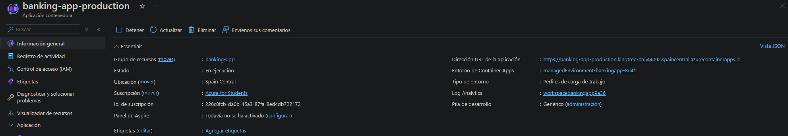

# Praćticas 2, 3 y 4 - Control de calidad de una aplicación web

**Grupo 7**

## Miembros del Equipo

| Nombre y Apellidos            | Correo URJC                     | Usuario GitHub   |
| :---------------------------- | :------------------------------ | :--------------- |
| Gonzalo Andrés Zurdo Patino   | ga.zurdo.2023@alumnos.urjc.es   | 51nga            |
| Raúl Tejada Merinero          | r.tejada.2023@alumnos.urjc.es   | raultejada24     |
| Adrián Varea Fernández        | a.varea.2023@alumnos.urjc.es    | blodresg         |
| Blas Vita Ramos               | b.vita.2020@alumnos.urjc.es     | Blasetvrtumi     |
| Adrián Villalba Cuello de Oro | a.villalba.2023@alumnos.urjc.es | AdrianVillalba26 |
| Arturo VInuesa Domínguez      | a.vinuesad.2023@alumnos.urjc.es | arturoovinuesaa  |

---

# Registro de Participación - Práctica 2, 3 y 4

## Índice

1. [Participación Práctica 2: Análisis y Testing Unitario](#participación-práctica-2-análisis-y-testing-unitario)
2. [Participación Práctica 3: Testing, Refactorización y Evaluación](#participación-práctica-3-testing-refactorización-y-evaluación)
3. [Participación Práctica 4: CD/CD](#asignación-de-tareas)

---

## Participación Práctica 2 (Análisis y Testing Unitario)

### **Alumno 1 - Gonzalo Andrés Zurdo Patino**

Mi participación se ha centrado en la revisión de formato del documento principal y en la detección manual de "Code Smells". Específicamente, he documentado aspectos relacionados con el acoplamiento y la encapsulación, aportando las evidencias gráficas necesarias para justificar las refactorizaciones.

| Nº  | Commits                                                                                                                                              |
| :-: | :--------------------------------------------------------------------------------------------------------------------------------------------------- |
|  1  | [Corrección de errores tipográficos y actualización de las referencias estéticas](https://github.com/arturoovinuesaa/cs-2026-grupo-7/commit/618b0c5) |
|  2  | [Detección y documentación técnica de nuevos Code Smells](https://github.com/arturoovinuesaa/cs-2026-grupo-7/commit/4e3336a)                         |
|  3  | [Adición de las capturas de pantalla de evidencia (imágenes) para el Issue 15](https://github.com/arturoovinuesaa/cs-2026-grupo-7/commit/9955bb6)    |

---

### **Alumno 2 - Raúl Tejada Merinero**

Me he encargado de la configuración inicial del entorno de análisis estático y la integración con SonarCloud, extrayendo las métricas del Overview y Dashboard. Además, he contribuido de manera central en la detección y documentación del bloque principal de Issues del proyecto.

| Nº  | Commits                                                                                                                                                             |
| :-: | :------------------------------------------------------------------------------------------------------------------------------------------------------------------ |
|  1  | [Adding New Issues](https://github.com/AdrianVillalba26/cs-2026-grupo-7/commit/d7f1d42ea27cae76a6fc924228275925a3835440)                                            |
|  2  | [Adding 7 new Issues](https://github.com/AdrianVillalba26/cs-2026-grupo-7/commit/7a3dd0d173d99d42bb770785dd64fa291fa46aca)                                          |
|  3  | [Update ANALISIS_CALIDAD.md](https://github.com/AdrianVillalba26/cs-2026-grupo-7/commit/ad68b11dd02a12861043afcfc70a0b3a7bdfb98c)                                   |
|  4  | [Update ANALISIS_CALIDAD.md with issues and refactoring notes](https://github.com/AdrianVillalba26/cs-2026-grupo-7/commit/538eb7685fcdd92ae53bc8c4ff8b6fb5be95c769) |
|  5  | [Adding new images](https://github.com/AdrianVillalba26/cs-2026-grupo-7/commit/e2674e155150a8599cb089aa3cdcafa004d04aaa)                                            |

---

### **Alumno 3 - Adrián Varea Fernández**

Mi contribución ha consistido en la identificación manual de problemas estructurales y de diseño de dominio, documentando detalladamente "bad smells" críticos como el uso de tipos primitivos (Primitive Obsession), estructuras de datos repetidas (Data Clumps) y vulnerabilidades por falta de validación lógica.

| Nº  | Commits                                                                                                                              |
| :-: | :----------------------------------------------------------------------------------------------------------------------------------- |
|  1  | [Issue 16: Data Clumps](https://github.com/AdrianVillalba26/cs-2026-grupo-7/commit/19033f910784fa4bfcdabb9cfe44a908ebb576f9)         |
|  2  | [Issue 21: Falta de validación](https://github.com/AdrianVillalba26/cs-2026-grupo-7/commit/80b2f292909fd6d00aed118a70a13955b1c0f150) |
|  3  | [Issue 22: Tipos primitivos](https://github.com/AdrianVillalba26/cs-2026-grupo-7/commit/561f4791b17b36eb05c2ed32191b0f692a987617)    |

---

### **Alumno 4 - Blas Vita Ramos**

Me he encargado de reestructurar y estandarizar el formato del archivo principal de análisis (Markdown) para garantizar su legibilidad y aspecto profesional. Paralelamente, he aportado detecciones manuales adicionales enfocadas en la mantenibilidad, como el uso de 'Magic Numbers' en la lógica de negocio.

| Nº  | Commits                                                                                                                              |
| :-: | :----------------------------------------------------------------------------------------------------------------------------------- |
|  1  | [2 new issues added](https://github.com/AdrianVillalba26/cs-2026-grupo-7/commit/99cc9ac84e66f89a1af48a416d8e05b5e23915b3)            |
|  2  | [Refactorización del readme](https://github.com/AdrianVillalba26/cs-2026-grupo-7/commit/12ccc92da272659b932838e414662f818939b4fa)    |
|  3  | [Issue 8: magic number añadido](https://github.com/AdrianVillalba26/cs-2026-grupo-7/commit/936c663f380bb45baf4c380841630dd76d581cab) |

---

### **Alumno 5 - Adrián Villalba Cuello de Oro**

He liderado la corrección de los hallazgos reportados por SonarCloud, solucionando discrepancias en el documento base. Además, he gestionado la actualización del repositorio de imágenes y la ampliación de descripciones técnicas para garantizar la exactitud de los Issues documentados.

| Nº  | Commits                                                                                                                                                                     |
| :-: | :-------------------------------------------------------------------------------------------------------------------------------------------------------------------------- |
|  1  | [Estructuración de archivos base y limpieza de mensajes autogenerados](https://github.com/AdrianVillalba26/cs-2026-grupo-7/commit/bf60220ce3f2a49f11a2961f82c2cd3c2f32c92c) |
|  2  | [Addition of image](https://github.com/AdrianVillalba26/cs-2026-grupo-7/commit/c821826e9989924cafa0eb695bb52d21bff3305f)                                                    |
|  3  | [Update ANALISIS_CALIDAD.md](https://github.com/AdrianVillalba26/cs-2026-grupo-7/commit/2491d292ae0ef007e1d89a24ad9f9dbb09e392f3)                                           |
|  4  | [Resolve problem images issue 1](https://github.com/AdrianVillalba26/cs-2026-grupo-7/commit/5d0d06c5bbe0993b7e629109c6f51fd58d09563b)                                       |

---

### **Alumno 6 - Arturo Vinuesa Domínguez**

Mi aportación ha consistido en realizar una inspección manual profunda de la clase `AccountService.java`. He detectado y documentado 4 issues relacionados con el alto acoplamiento, "Feature Envy" y violaciones de Clean Architecture que las herramientas automáticas no pueden detectar.

| Nº  | Commits                                                                                                                                 |
| :-: | :-------------------------------------------------------------------------------------------------------------------------------------- |
|  1  | [4 new issues added from 17 to 20](https://github.com/AdrianVillalba26/cs-2026-grupo-7/commit/8ad5aa6e73a5517b2916f0f8b10309dd61b60cea) |

---

## Participación Práctica 3 (Testing, Refactorización y Evaluación)

### **Alumno 1 - Gonzalo Andrés Zurdo Patino**

A lo largo de esta práctica, he contribuido principalmente en la mejora de la calidad del código y a la creación de tests. Realicé un refactoring de las issues 8,9,12 y 17 del AccountService eliminando números mágicos y excepciones genéricas. Además, implementé una suite completa de pruebas end-to-end con Selenium para validar la funcionalidad de transferencias bancarias, proporcionando mayor cobertura de pruebas. También participé en la documentación del proyecto, mejorando el análisis de calidad y la información del equipo. En resumen, mi trabajo se enfocó en resolver los issues que identificamos en la práctica enterior, implementar prácticas de testing sólidas y mantener una documentación clara.

| Nº  | Commits                                                                                                                                                                                            |
| :-: | :------------------------------------------------------------------------------------------------------------------------------------------------------------------------------------------------- |
|  1  | [refactor: replace magic numbers and generic exceptions in AccountService (issues 8,9,12,17)](https://github.com/AdrianVillalba26/cs-2026-grupo-7/commit/ddb0f751880f08cb52d28a7edb782c380ec5de72) |
|  2  | [test: add E2E Selenium suite for bank transfer functionality validation](https://github.com/AdrianVillalba26/cs-2026-grupo-7/commit/871a33fbc89f98f262912105eacd77082c2f3963)                     |
|  3  | [test: bad test implementation](https://github.com/AdrianVillalba26/cs-2026-grupo-7/commit/f87c2394aa9f77192ffe0e342e3dcb66c870cb22)                                                               |

---

### **Alumno 2 - Raúl Tejada Merinero**

Mi participación en la práctica ha sido transversal, abarcando desde la arquitectura de pruebas hasta la refactorización. He liderado el plan de pruebas implementando gran parte de la suite unitaria con Mockito, lo que nos permitió alcanzar un 100% de cobertura en JaCoCo. Apoyándome en esta base segura, he refactorizado la lógica de AccountService.java para resolver Bad Smells críticos y eliminar código muerto. Finalmente, he desarrollado varias de las pruebas automáticas End-to-End con Selenium WebDriver.

| Nº  | Commits                                                                                                                                                                                                                                                                                      |
| :-: | :------------------------------------------------------------------------------------------------------------------------------------------------------------------------------------------------------------------------------------------------------------------------------------------- |
|  1  | [test: add base structure, dependencies, and test format for AccountServiceTest.](https://github.com/AdrianVillalba26/cs-2026-grupo-7/commit/30c730d8e69e38d53994e00922364986d739d00d)                                                                                                       |
|  2  | [test: Implement 2 tests cases. Add end-to-end tests for transfer functionality with Selenium WebDriver](https://github.com/AdrianVillalba26/cs-2026-grupo-7/commit/631ceefbd4a0dfb96ed50081ef6f7540784ba11b)                                                                                |
|  3  | [Refactor AccountService methods to improve readability and maintainability by centralizing validation logic, using descriptive method names, and encapsulating notification handling.](https://github.com/AdrianVillalba26/cs-2026-grupo-7/commit/976f0377f87f41d0850ad36232b70beea0995b88) |
|  4  | [docs: Prepare ANALISIS_CALIDAD.md and fix all unit tests format for my team.](https://github.com/AdrianVillalba26/cs-2026-grupo-7/commit/8a5d223c710504e34c2773c83bbee5e1d32e591d#diff-236eef4ec2bfa3b517490d14d60c375e7169b7dabfc0eb0f5f91f13f8b096b3a)                                    |
|  5  | [refactor: update notification handling and validation in AccountService; enhance test coverage](https://github.com/AdrianVillalba26/cs-2026-grupo-7/commit/474a9045bd275e2c49b81f40a334872fd4b3041a)                                                                                        |

---

### **Alumno 3 - Adrián Varea Fernández**

Mi participación ha consistido principalmente en implementar en cada una de las fases los test y refactorizaciones correspondientes.

| Nº  | Commits                             |
| :-: | :---------------------------------- |
|  1  | [tests: implemented tests numbers 36 and 37](https://github.com/AdrianVillalba26/cs-2026-grupo-7/commit/50c68f1b5d8cd2b9640d54efa596d710a0d8a635) |
|  2  | [Refactor for issue 22 implemented](https://github.com/AdrianVillalba26/cs-2026-grupo-7/commit/9b4b69a9eeee9a39759cecbc3f5448b22418b034) |
|  3  | [test 9 : add transferAtExactLimit_Success](https://github.com/AdrianVillalba26/cs-2026-grupo-7/commit/25c6e3a0ed53636f9f392a5053f6edf7b71036a5) |


---

### **Alumno 4 - Blas Vita Ramos**

Mi participación en esta parte práctica de la asignatura ha sido integral, similarmente a la de otros compañeros, abarcando desde la aplicación de refactorizaciones como las 11 14 y 15 para poner solución a los bad smells en el código, hasta tests (tanto unitarios como E2E) con el fin de poder asegurar un buen funcionamiento de la aplicación a largo plazo.

| Nº  | Commits                                                                                                                                                                                         |
| :-: | :---------------------------------------------------------------------------------------------------------------------------------------------------------------------------------------------- |
|  1  | [Remaining deposit tests, quick deposit exception and mailnotification tests implemented](https://github.com/AdrianVillalba26/cs-2026-grupo-7/commit/09f96b96282cfb28c9eecfe45bf92bbdc53cc299)  |
|  2  | [Quick deposit succes SMS and nonotification, withdraw success with SMS tests implemented](https://github.com/AdrianVillalba26/cs-2026-grupo-7/commit/07dd82cfa624f800d9303bf37d63dec4280fa294) |
|  3  | [Refactors for issues 11, 14 and 15](https://github.com/AdrianVillalba26/cs-2026-grupo-7/commit/a182cd9b94ffd806690165b851baed3a48239871)                                                       |
|  4  | [Added fail tests 3 4 and 5](https://github.com/AdrianVillalba26/cs-2026-grupo-7/commit/282ba87592d0f38977c7a74865739b8aeaf37427)                                                               |

---

### **Alumno 5 - Adrián Villalba Cuello de Oro**

Mi participación en la práctica se ha centrado en la realización de las pruebas unitarias 1, 5, 6, 9, 10, 27 y 34, cubriendo distintos escenarios para cubrir el correcto funcionamiento del sistema. También he contribuido con la refactorización del código en los issues 7, 10, 16, 18 y 20, mejorando su calidad y mantenibilidad. Además, me he encargado de hacer la prueba de sistema 6, verificando que no se permitan transferencias superiores a 20000 €, garantizando el cumplimiento de la restricción impuesta.

| Nº  | Commits                                                                                                                      |
| :-: | :--------------------------------------------------------------------------------------------------------------------------- |
|  1  | [Refactor withdrawal method by removing unused variable](https://github.com/AdrianVillalba26/cs-2026-grupo-7/commit/2b7badb) |
|  2  | [Addition of some refactorizations](https://github.com/AdrianVillalba26/cs-2026-grupo-7/commit/863c872)                      |
|  3  | [Addition of some refactorizations v2](https://github.com/AdrianVillalba26/cs-2026-grupo-7/commit/0f72fde)                   |
|  4  | [Realization of unit testing](https://github.com/AdrianVillalba26/cs-2026-grupo-7/commit/db20c15)                            |
|  5  | [5 refactorings implemented](https://github.com/AdrianVillalba26/cs-2026-grupo-7/commit/eb0973a)                             |
|  6  | [System Test 6](https://github.com/AdrianVillalba26/cs-2026-grupo-7/commit/2bde0a0)                                          |

---

### **Alumno 6 - Arturo Vinuesa Domínguez**

Mi participación se ha basado en completar en cada fase los test y refactorizaciones correspondientes.
| Nº | Commits |
|:---:|:--- |
| 1 | [Test](https://github.com/AdrianVillalba26/cs-2026-grupo-7/commit/4f27e0450f777d26230ceb2b60150888c59fbe69) |
| 2 | [Refactorizaciones de las issues 13, 19 y 21](https://github.com/AdrianVillalba26/cs-2026-grupo-7/commit/4de18088b7d94d07beff83cad33855bf4d04c44f) |
| 3 | [test: update Selenium dependency to version 4.42.0 and enhance transferInvalidAccount_Fail test case](https://github.com/AdrianVillalba26/cs-2026-grupo-7/commit/f681d5050cf6425dde02cd8528396bef4de5c2f9) |

# Praćtica 4 - Implementación de pipelines de CI-CD y desarrollo colaborativo 

### Captura de la aplicación desplegada en Azure
> Inserta aquí una captura de la aplicación desplegada. Debe aparecer la URL de la aplicación desplegada y el número de versión desplegada (pantalla de login)


### Captura del dashboard de Azure con la última versión desplegada
> Inserta aquí una captura del dashboard de Azure. La captura debe mostrar lo mismo que aparece en la diapositiva 26 de "Anexo -Despliegue de aplicaciones en Azure"



## Desarrollo con GitHubFlow

### Asignación de tareas

| Tarea | Alumno/es asignado/s | Commits asociados |
| :--- | :--- | :--- |
| **feature-1** | Raúl Tejada Merinero, Blas Vita Ramos | [Commit Funcionalidad](https://github.com/AdrianVillalba26/cs-2026-grupo-7/commit/fa18349), [Commit Pruebas](https://github.com/AdrianVillalba26/cs-2026-grupo-7/commit/3b53e12) |
| **feature-2** | Adrián Villalba Cuello de Oro, Adrián Varea Fernández | [Commit Funcionalidad]([https://github.com/AdrianVillalba26/cs-2026-grupo-7/commit/ced107a5d64e64e22f4c5f133d73f7b6dd029fc6]), [Commit Pruebas]([AÑADIR_URL]) |
| **feature-3** | Arturo Vinuesa Domínguez, Gonzalo Andrés Zurdo Patino | [Commit Funcionalidad]([AÑADIR_URL]), [Commit Pruebas]([AÑADIR_URL]) |
| **refactoring-1** | Raúl Tejada Merinero | [Commit CS1](https://github.com/AdrianVillalba26/cs-2026-grupo-7/commit/8b1e213) ... [Commit Bump v1.0.1](https://github.com/AdrianVillalba26/cs-2026-grupo-7/commit/d056918) |

### Pasos seguidos

Una vez creados los workflows y funcionando estos, pasamos a crear la nueva funcionalidad utilizando GithubFlow:

Clonamos el repositorio

```
$ git clone git@github.com:codigus-formacion-se/banking-app-2026.git
```

## Flujo de Trabajo con Git

### 1. Crear una nueva rama para la funcionalidad (Feature Branch)

Creamos y nos movemos a una rama aislada para desarrollar la nueva feature sin afectar a la rama principal (`main`).

```bash
git checkout -b feature-nueva-funcionalidad
```

### 2. Desarrollo y registro de cambios (Commits)

Una vez implementada la funcionalidad (por ejemplo, mostrar la versión en el login), añadimos los archivos modificados al staging area y creamos un commit con un mensaje descriptivo.

```bash
git add .
git commit -m "feat: mostrar versión de la app en la pantalla de login"
```

### 3. Subir la rama al repositorio remoto

Empujamos nuestra rama local a GitHub para que el resto del equipo pueda verla y se ejecuten las comprobaciones de CI/CD.

```bash
git push origin feature-nueva-funcionalidad
```

### 4. Creación del Pull Request (PR) y validación

A través de la interfaz web de GitHub, abrimos un Pull Request desde nuestra rama `feature-nueva-funcionalidad` hacia `main`. Esto dispara automáticamente el Workflow 2 (pruebas unitarias y de sistema E2E). Solicitamos la revisión de un compañero (Code Review).

### 5. Integración (Merge a main)

Una vez que el Workflow 2 pasa en verde y el código está aprobado, pulsamos el botón **"Merge pull request"** en la interfaz web de GitHub. Al integrarse en `main`, esto lanza automáticamente el Workflow 3 (construcción de imagen Docker y despliegue en Azure).

### 6. Sincronización y limpieza del repositorio local

Volvemos a nuestra rama principal local, descargamos los últimos cambios integrados (el merge) y borramos la rama de la feature que ya no necesitamos para mantener el repositorio limpio.

```bash
git checkout main
git pull origin main
git branch -d feature-nueva-funcionalidad
```

## Workflow 4

Todos los días a las 02:00 AM UTC se ejecuta el job de Nightly que:
1) Utiliza una matriz de ejecución (strategy: matrix) para lanzar las pruebas de sistema (E2E) de forma cruzada en distintos sistemas operativos y navegadores: Chrome y Firefox (en Linux, Windows y MacOS), Edge (solo en Windows) y Safari (solo en MacOS).
2) Si todas estas pruebas cruzadas finalizan con éxito, un segundo job empaqueta la aplicación web en una imagen Docker.
3) Genera un tag dinámico basado en la fecha actual utilizando el formato nightly-YYYYMMDD (por ejemplo, nightly-20260429).
4) Sube la imagen probada y con el tag correspondiente al registro público de DockerHub.

- [ÚLTIMA EJECUCIÓN](URL_ultima_ejecucion_workflow_4)

